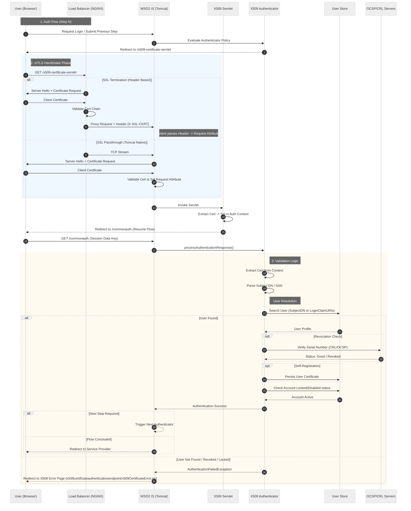

# Custom X509 Certificate Authenticator for WSO2 Identity Server

This repository contains a sample **X509 Certificate Authenticator** for WSO2 Identity Server (IS) 5.10.0. It
enables robust mutual TLS (mTLS) authentication flows, supporting both **SSL Termination** (at a Load Balancer) and 
**SSL Passthrough** (direct to WSO2 IS).

## Features

* **Flexible Identity Resolution:** Supports resolving users via Subject DN, Subject Alternative Name (SAN) regex, or
  custom Claim URIs.

* **Compound (Multi-Attribute) Resolution:** Optionally resolves a user by matching several values extracted from a
  single certificate field against multiple claims with **AND** semantics — used to disambiguate attributes that are
  not unique on their own.

* **Hybrid mTLS Architecture:** Compatible with proxy-terminated SSL (via `X-SSL-CERT` header) or direct Tomcat mTLS
  connectors.

* **Secondary User Store Search:** Optionally searches across all connected user stores if the domain is not specified
  in
  the certificate.

* **Self-Registration:** Automatically associates the authentication certificate with the user's profile upon successful
  login if enabled.

* **Revocation Checks:** Integrated CRL and OCSP validation using WSO2's `RevocationValidationManager`.

* **Account Status Validation:** Validates if the account is locked or disabled before allowing access.

---

## Architecture

The authentication process relies on a dedicated servlet endpoint to handle the certificate handshake. This design
decouples the mTLS requirement from the main console, allowing standard login flows to coexist with certificate-based
authentication.

### Authentication Flow

1. **Initial Request:** The user attempts to access a service provider and is redirected to WSO2 IS.
2. **Redirection:** The X509 Authenticator redirects the user to a specific servlet (`/x509-certificate-servlet`).
3. **Handshake:** The browser negotiates mTLS at this endpoint.

* **SSL Termination:** The Load Balancer handles the handshake and passes the cert in a header.
* **SSL Passthrough:** The Load Balancer tunnels traffic; WSO2 IS handles the handshake.

4. **Validation:** The authenticator retrieves the certificate, resolves the user, checks revocation status, and
   validates account status.

### Sequence Diagram



---

## Configuration

Configuration is managed via `deployment.toml`. The parameters below map directly to constants defined in
`X509CertificateConstants.java`.

### 1. Enable the Authenticator

Add the following to your `deployment.toml` to register the custom authenticator:

```toml
[[authentication.custom_authenticator]]
name = "CustomX509CertificateAuthenticator"
enable = true
```

### 2. Parameter Reference

All parameters below are set under the authenticator's `parameters.*` namespace in `deployment.toml`.

| Parameter                 | Default                                | Description                                                                                                                                                                                 |
|---------------------------|----------------------------------------|---------------------------------------------------------------------------------------------------------------------------------------------------------------------------------------------|
| `AuthenticationEndpoint`  | `https://localhost:8443/x509-certificate-servlet` | **Required.** The full URL to the X509 Servlet (e.g., `https://identityserver.local:8443/x509-certificate-servlet`). A warning is logged and the default is used if unset.        |
| `username`                | *None*                                 | The RDN type in the Subject DN to treat as the username / lookup value (e.g., `CN`, `emailAddress`, `serialNumber`). Also used as the source field for `UsernameRegex`.                     |
| `UsernameRegex`           | *None*                                 | A regex applied to the `username` RDN value to extract the lookup value. Supports **named capture groups**, which are consumed by `CompoundClaimMapping`. Takes precedence over the raw RDN value. |
| `AlternativeNamesRegex`   | *None*                                 | A regex applied to the Subject Alternative Name (SAN) entries to extract the lookup value. Takes precedence over Subject DN resolution.                                                     |
| `LoginClaimURIs`          | `http://wso2.org/claims/username`      | Comma-separated Claim URIs searched (**OR** semantics, single value) when resolving the user. Ignored when `CompoundClaimMapping` is set.                                                   |
| `CompoundClaimMapping`    | *None*                                 | Enables **AND**-based multi-attribute resolution by mapping `UsernameRegex` named groups to Claim URIs. Format: `group:claimURI,group:claimURI`. See [Compound resolution](#compound-multi-attribute-user-resolution). |
| `PrimaryClaimGroup`       | *first `CompoundClaimMapping` entry*   | The `CompoundClaimMapping` group used as the primary (always-present, most selective) lookup key. The remaining groups narrow the candidates.                                               |
| `SearchAllUserStores`     | `false`                                | If `true`, searches for the resolved username across all connected user stores (useful if the domain is not provided in the certificate).                                                  |
| `EnforceSelfRegistration` | `false`                                | If `true`, stores the authentication certificate in the user's profile upon first successful login.                                                                                        |
| `CheckUserCertClaim`      | `false`                                | If `true`, validates the presented certificate against the certificate stored in the user's claim. When unset or `false`, this stored-claim check is skipped.                              |
| `setClaimURI`             | `http://wso2.org/claims/userCertificate` | The Claim URI used to store and read the user's certificate (used by `EnforceSelfRegistration` and `CheckUserCertClaim`).                                                                 |

> **Note on `X-SSL-CERT`:** The HTTP header carrying the certificate during SSL Termination is **not** an authenticator
> parameter — it is configured on the certificate valve (`X509RequestHeaderName`, default `X-SSL-CERT`). See
> [Transport Configuration](#3-transport-configuration).

#### Example `deployment.toml`

```toml
[[authentication.custom_authenticator]]
name = "CustomX509CertificateAuthenticator"
parameters.AuthenticationEndpoint = "https://identityserver.local:8443/x509-certificate-servlet"
parameters.username = "ExternalID"
parameters.LoginClaimURIs = "http://wso2.org/claims/externalId,http://wso2.org/claims/username"
parameters.SearchAllUserStores = true
parameters.EnforceSelfRegistration = true
```

### Compound (Multi-Attribute) User Resolution

By default the authenticator resolves a user from a **single** value (the Subject DN RDN, a regex match, a SAN match,
or a `LoginClaimURIs` lookup). When that value is **not unique** across the user store, the lookup matches more than
one entry and authentication fails with a `USERNAME_CONFLICT` (`20015`).

`CompoundClaimMapping` solves this by resolving the user from **several values extracted from one certificate field**,
combined with **AND** semantics. It uses only claim-based user-store APIs, so it works uniformly across **JDBC** and
**LDAP/AD** user stores.

**How it works:**

1. `UsernameRegex` is written with **named capture groups**, each capturing one value from the configured `username`
   RDN.
2. `CompoundClaimMapping` maps every named group to a Claim URI.
3. `PrimaryClaimGroup` (or the first mapping entry) is searched first; the resulting candidates are then narrowed by
   comparing each remaining group's value against its claim. Only a candidate matching **all** of them is accepted.
4. If exactly one user matches, it is resolved. If none match, the result is `USER_NOT_FOUND` (`17001`). If more than
   one still matches every value, it is a genuine `USERNAME_CONFLICT` (`20015`).

**Example** — a certificate carries a composite identifier in the `serialNumber` RDN of the form
`ID{region}-{employeeNumber}`, where `{region}` is an optional two-letter code. Employee numbers can repeat across
regions, so both values are needed to identify a person uniquely:

```toml
parameters.username = "serialNumber"
parameters.UsernameRegex = "ID(?<region>[A-Z]{2})?-(?<employeeNumber>[A-Za-z0-9]+)"
parameters.CompoundClaimMapping = "employeeNumber:http://wso2.org/claims/employeeNumber,region:http://wso2.org/claims/region"
parameters.PrimaryClaimGroup = "employeeNumber"
```

For `serialNumber=IDUK-A1B2C3`, this searches `http://wso2.org/claims/employeeNumber == "A1B2C3"` and keeps only the
candidate whose `http://wso2.org/claims/region == "UK"`.

**Notes:**

* **Claim-to-attribute mapping is required.** Each Claim URI in the mapping must be mapped to the underlying user-store
  attribute in your claim configuration (e.g., `http://wso2.org/claims/region` → LDAP `c`). The authenticator resolves
  the attribute through the standard claim layer, so it never references store-specific attribute names directly.
* **Empty / absent values.** When an optional group does not match (e.g. `serialNumber=ID-A1B2C3`, no region), its value
  is treated as empty. The comparison treats `null` and empty as equivalent (so a user with an empty or unset attribute
  matches), and it is trimmed and case-insensitive.
* **Backward compatible.** When `CompoundClaimMapping` is not set, single-value resolution (via `LoginClaimURIs`) is used
  exactly as before. A `UsernameRegex` without named groups also behaves as before.

### 3. Transport Configuration

You must configure a connector to handle the certificate traffic.

* **Dedicated mTLS Port (Recommended)**
  Segregates mTLS traffic to port 8443, leaving 9443 for standard console access.

```toml
[custom_transport.x509.properties]
protocols = "HTTP/1.1"
port = "8443"
maxThreads = "200"
scheme = "https"
secure = true
SSLEnabled = true
# Keystore containing the server's private key
keystoreFile = "${carbon.home}/repository/resources/security/wso2carbon.jks"
keystorePass = "wso2carbon"
# Truststore containing the CA certificates allowed to sign client certs
truststoreFile = "${carbon.home}/repository/resources/security/client-truststore.jks"
truststorePass = "wso2carbon"
bindOnInit = false
clientAuth = "require"
ssl_protocol = "TLS"
```

* **SSL Termination (Proxy)**
  If using NGINX/Load Balancer to terminate SSL, enable the **Certificate Valve** to parse the certificate header.

```toml
[x509]
enable_certificate_authentication_valve = true
request_header_encoded = true
```

  The valve (from `identity-x509-commons`) reads the certificate from the header named by `X509RequestHeaderName`
  (default `X-SSL-CERT`) and treats it as URL-encoded when `X509RequestHeaderEncoded` is enabled (the
  `request_header_encoded` setting above). These are **valve** settings, not authenticator `parameters.*`.

---

## Infrastructure Setup

### 1. Registry & CA Setup (Critical)

For the authenticator to perform revocation checks (CRL/OCSP), the Certificate Authority (CA) chain must be defined in
the WSO2 Registry.

1. **Prepare Certificates:** Ensure you have your Root CA and Intermediate CA PEM files.
2. **Determine Registry Paths:** Use the [
   `cert-path-tool`](https://github.com/vfraga/wso2is-x509-cacert-registry-path-tool) to generate the correct normalized
   registry path for your CAs.

```bash
java -jar cert-path-tool-1.0.0.jar -f /path/to/root-ca.pem -s
```

3. **Create Collections:**

* Navigate to `/_system/governance/repository/security/certificate`.
* **Crucial:** Manually create a collection named `certificate-authority` if it does not exist.
* Inside `certificate-authority`, create a collection matching the output from the tool (e.g., `cn:3Drootca...`).


4. **Create Resource:**

* Inside the specific CA collection, add a new **Resource** (Name it anything, e.g., `content`).
* **Content:** Paste the PEM content (Body only, remove headers (i.e. `BEGIN CERTIFICATE`, `END CERTIFICATE`) and
  newlines).

5. **Add Properties:**
   Add the following properties to the registry resource.

* `crl`: `true` (Value is arbitrary/unused; existence triggers the validator).
* `ocsp`: `true` (Value is arbitrary/unused).
* *Note: The actual CRL/OCSP URLs are extracted dynamically from the client certificate's AIA and CDP extensions.*

### 2. Load Balancer (NGINX) Setup

Configure NGINX to validate the client certificate and pass it to WSO2 IS.

```nginx
server {
    listen 8444 ssl; # Dedicated mTLS port on LB
    server_name identityserver.local;
    
    ssl_client_certificate /etc/nginx/certs/root_ca.pem;
    ssl_verify_client on; # Enforce mTLS

    location / {
        proxy_pass https://mtls.identityserver.local;
        
        # Pass the certificate to WSO2 IS
        # modern NGINX versions use $ssl_client_escaped_cert for URL encoding
        proxy_set_header X-SSL-CERT $ssl_client_escaped_cert;
    }
}
```

---

## Logging & Debugging

To enable debug logs for the authenticator, modify the `log4j2.properties` file found in `<IS_HOME>/repository/conf`.

1. Append `custom_x509` to the list of loggers:

```properties
loggers = AUDIT_LOG, ..., custom_x509
```

2. Add the logger configuration:

```properties
logger.custom_x509.name = org.wso2.support.sample.x509authenticator
logger.custom_x509.level = DEBUG
```

### Common Error Codes

| Error Code | Constant                                  | Description                                                                                            |
|------------|-------------------------------------------|--------------------------------------------------------------------------------------------------------|
| `18013`    | `X509_CERTIFICATE_NOT_FOUND`              | No certificate found in the request context or header.                                                 |
| `18015`    | `X509_CERTIFICATE_NOT_VALID`              | A certificate was presented but failed validation against the user store (e.g. stored-claim mismatch). |
| `18003`    | `USERNAME_NOT_FOUND_ON_X509_CERTIFICATE`  | No username could be extracted from the certificate attribute (fallback resolution).                   |
| `17007`    | `SUBJECT_DN_REGEX_NO_MATCHES`             | `UsernameRegex` was configured but matched no value in the Subject DN.                                  |
| `17006`    | `SUBJECT_DN_MULTIPLE_MATCHES`             | `UsernameRegex` matched more than one distinct value in the Subject DN.                                 |
| `17008`    | `ALT_NAME_NOT_FOUND`                      | `AlternativeNamesRegex` was configured but the certificate has no Subject Alternative Names.            |
| `17005`    | `ALT_NAME_NO_MATCHES`                     | `AlternativeNamesRegex` matched no SAN value.                                                           |
| `17004`    | `ALT_NAME_MULTIPLE_MATCHES`               | `AlternativeNamesRegex` matched more than one SAN value.                                                |
| `17001`    | `USER_NOT_FOUND`                          | Certificate valid, but no matching user found in the user store.                                       |
| `20015`    | `USERNAME_CONFLICT`                       | The certificate resolves to multiple users or a different user than the one currently in the session.  |
| `17002`    | `USER_ACCOUNT_LOCKED`                     | The resolved user account is locked.                                                                   |
| `17010`    | `USER_ACCOUNT_DISABLED`                   | The resolved user account is disabled.                                                                 |
| `17003`    | `NOT_VALIDATED`                           | Certificate revocation validation (CRL/OCSP) failed or errored.                                        |
